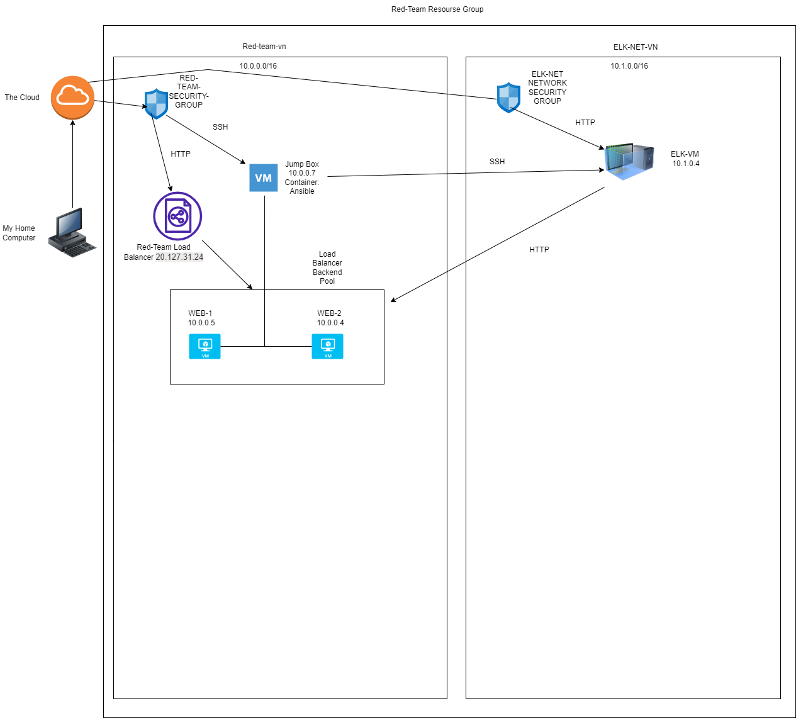

## Automated ELK Stack Deployment

The files in this repository were used to configure the network depicted below.

These files have been tested and used to generate a live ELK deployment on Azure. They can be used to either recreate the entire deployment pictured above. Alternatively, select portions of the YAML file may be used to install only certain pieces of it, such as Filebeat.

  - Enter the playbook file._

This document contains the following details:
- Description of the Topology
- Access Policies
- ELK Configuration
  - Beats in Use
  - Machines Being Monitored
- How to Use the Ansible Build

### Description of the Topology

The main purpose of this network is to expose a load-balanced and monitored instance of DVWA, the D*mn Vulnerable Web Application.

Load balancing ensures that the application will be highly ACCESSIBLE, in addition to restricting TRAFFIC to the network.
- : What aspect of security do load balancers protect?  ACCESSIBILITY.   What is the advantage of a jump box?  IT GIVES THE ABILITY TO ACCESS AND MANAGE DEVICES IN A SECURE ZONE.

Integrating an ELK server allows users to easily monitor the vulnerable VMs for changes to the APPLICATIONS and system LOGS.
- What does Filebeat watch for?

It monitors specified log files and locations and forwards them to Elasticsearch/Logstash (the E and L in ELK) for indexing.

- What does Metricbeat record? Filebeat monitors, Metricbeat records metrics or statistical data and forwards them to the output that are specified thru Elasticsearh/Logstash for indexing

The configuration details of each machine may be found below.

| Name     | Function | IP Address | Operating System |
|----------|----------|------------|------------------|
| Jump Box | Gateway |10.0.0.1   | Linux      |
| ELKserver|   VM       |10.1.0.4   | Linux     |             
| Web-1       |  VM        |10.0.0.5   | Linux     |
| Web-2       |   VM       |10.0.0.6   | Linux     |

### Access Policies

The machines on the internal network are not exposed to the public Internet. 

Only the Jump Box-Provisioner machine can accept connections from the Internet. Access to this machine is only allowed from the following IP addresses:
- Add whitelisted IP addresses  104.58.26.12  my local machine IP

Machines within the network can only be accessed by Jump Box SSH
- Which machine did you allow to access your ELK VM? Jump Box  What was its IP address? 20.127.19.193

A summary of the access policies in place can be found in the table below.

| Name     | Publicly Accessible | Allowed IP Addresses |
|----------|---------------------|----------------------|
| Jump Box  | Yes           |   20.127.19.193  |
|  Web-1       | No            |      10.0.0.5         |
|  Web-2       | No            |      10.0.0.6         |

### Elk Configuration

Ansible was used to automate configuration of the ELK;;l;.'/ machine. No configuration was performed manually, which is advantageous because you can make one change and it will feed it to all machines.  
- What is the main advantage of automating configuration with Ansible?  It can be used and changed no matter where it is deployed.

The playbook implements the following tasks:
-Create a new Virtual Network in Azure
-Create a peer-to-peer connection between virtual networks in the same resource group
-Create a new Virtual Machine in the new Virtual Network with required CPU and memory requirements and add that new                Virtual Machine to the Ansible hosts file in the provisioner Virtual Machine
-Create an Ansible playbook installing Docker and configures an ELK container and run the playbook to launch it.
-Restrict access to the ELK VM.  
The following screenshot displays the result of running `docker ps` after successfully configuring the ELK instance.

!Update the path with the name of your screenshot of docker ps output](Images/docker_ps_output.png)
https://github.com/jim-macke/ELK_PROJECT_jim/blob/jim-WashU/ansible/Docker_PS.png
### Target Machines & Beats
This ELK server is configured to monitor the following machines:
-10.0.0.4   10.0.0.5 

We have installed the following Beats on these machines:
- filebeats and metricbeats 

These Beats allow us to collect the following information from each machine:
- Filebeat monitors specific log files, collects log events and forwards them to Elasticsearch or Logstash for indexing.
-Metricbeats monitors metrics, like CPU usage, memory, and load and sends that sends that to Elasticsearch. 
### Using the Playbook
In order to use the playbook, you will need to have an Ansible control node already configured. Assuming you have such a control node provisioned: 

SSH into the control node and follow the steps below:
- Copy the ansible host file to /etc/ansible/hosts.txt
- Update the host file to include 10.0.0.4  10.0.0.5  10.0.0.6
- Run the playbook, and navigate to Kibana to check that the installation worked as expected.

_  Answer the following questions to fill in the blanks:_
- Which file is the playbook? Roles. Where do you copy it?  To Web VMs
- Which file do you update to make Ansible run the playbook on a specific machine? Config file  How do I specify which machine to install the ELK server on versus which to install Filebeat on?  This is designated in the config file
- Which URL do you navigate to in order to check that the ELK server is running?

_As a **Bonus**, provide the specific commands the user will need to run to download the playbook, update the files, etc._
